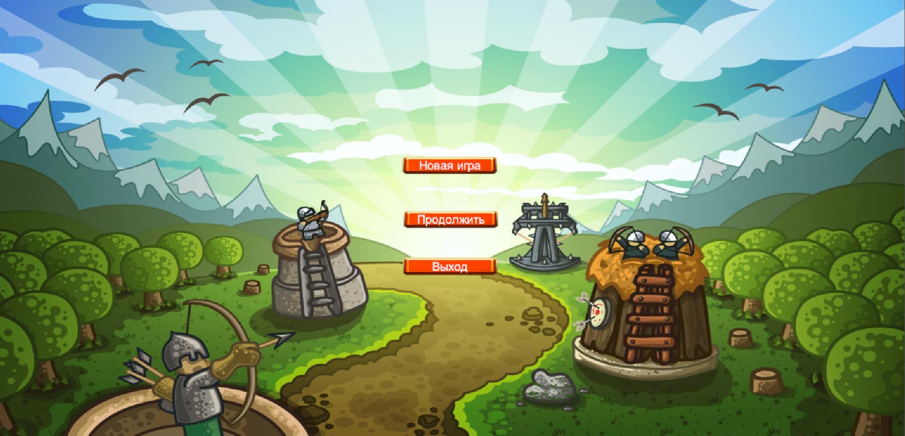
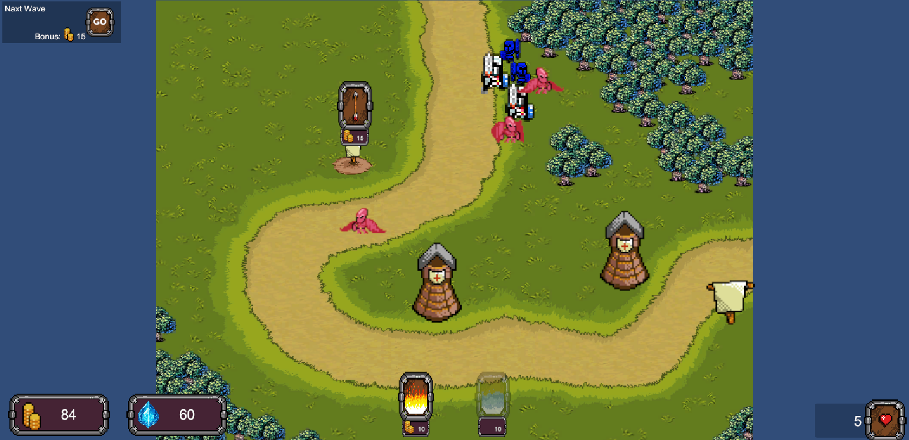
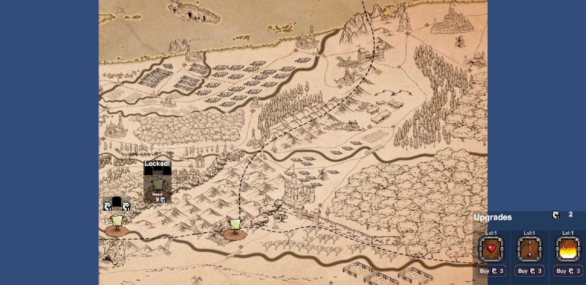

# 🏰 TowerDefence

2D-игра в жанре **Tower Defense**, разработанная на **Unity** с использованием **C#**.

Проект создан в процессе обучения разработке игр и демонстрирует работу с игровой логикой, противниками, уровнями, способностями и другими механиками Unity.

## 🎮 Об игре

Игроку необходимо защищаться от наступающих противников, используя доступные игровые механики и способности.

В проекте реализованы различные уровни, противники, система игровых способностей и улучшений.

## 📸 Скриншоты

### Главное меню

### Игровой процесс

### Карта уровней и система улучшений

## ⚙️ Реализованные механики

- Система уровней
- Волны противников
- Передвижение и поведение противников
- Система игровых способностей
- Нанесение урона
- Улучшение способностей
- Работа с анимациями
- Пользовательский интерфейс
- Главное меню
- Карта выбора уровней
- Сохранение прогресса
- Игровая логика на C#

## 🛠 Технологии

- Unity
- C#
- Git
- GitHub
- Visual Studio

## 👨‍💻 Разработчик

**Никита Чикишев**

Начинающий Unity / C# разработчик.

Проект выполнен в рамках обучения в **SkillFactory**.

📍 Екатеринбург, Россия
